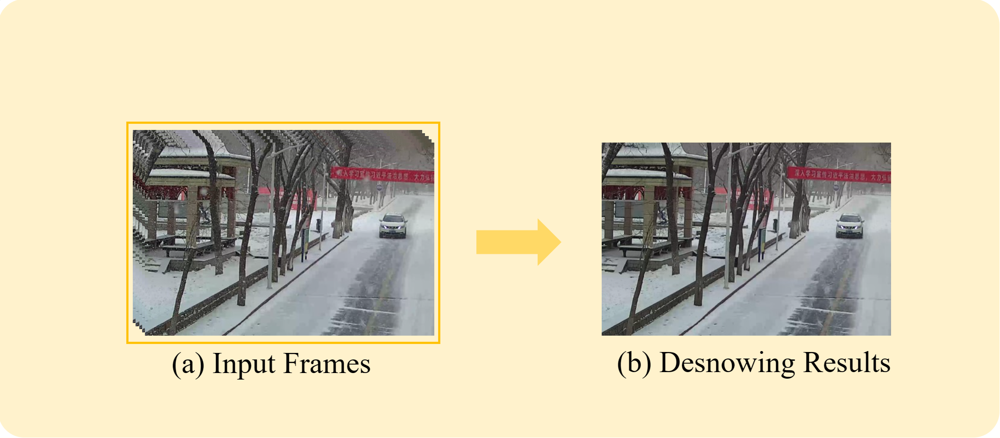

# Depth-prior-based-stable-tensor-decomposition-for-video-snow-removal 


# Abstract
Heavy snow seriously degrades the performance of outdoor computer vision systems. Near- and far-field snowflakes in heavy snow videos exhibit distinctly disparate physical properties. To address the issue, this research proposes a video desnowing model that utilizes stable tensor decomposition with snow depth prior information. Initially, the depth of snowflakes is transformed by their speeds calculated from the optical flow field of snowfall. Next, the noise level in backgrounds is available by dense snow. In contrast to previous tensor decomposition (TD), the introduction of a noise term enhances the stability of the depth prior-based stable tensor decomposition (DP-STD) in addressing heavy snowfall. This leads to more efficient and accurate restoration of underlying nonsnow structure. Inspired by biomimicry, the snow on moving objects (MOs) is removed by the adaptive mimesis region of interest (AM-ROI). Both synthetic and real snowfall experimental results show that our proposed desnowing model is more effective than the current SOTA algorithm in removing heavy snow.

<p align="center">

</p>

# Code
The official repository of Depth prior-based stable tensor decomposition for video snow removal.
  ```
The key package has been provided.
  ```

# Contact
If you have any questions, please contact Yongji Li (liyj328@mail2.sysu.edu.cn).
